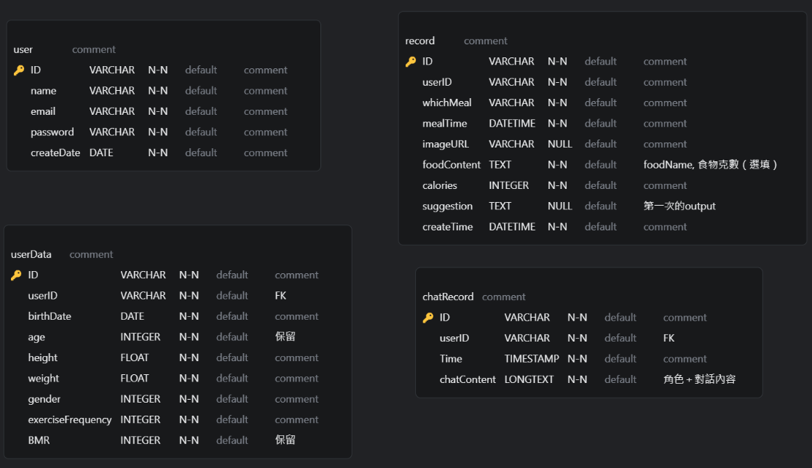

# API 設計

## 登入相關

 
<code>POST</code> <code><b>/</b></code> <code>signup</code>

### Parameters

> | name     | type     | data type | description |
> | -------- | -------- | --------- | ----------- |
> | userName | required | string    | 使用者名稱  |
> | email    | required | string    | 信箱        |
> | password | required | string    | 密碼        |

### Responses

> | http code | response   |
> | --------- | ---------- |
> | `200`     | `註冊成功` |

 
<code>PUT</code> <code><b>/</b></code> <code>login</code>

### Parameters

> | name     | type     | data type | description |
> | -------- | -------- | --------- | ----------- |
> | email    | required | string    | 信箱        |
> | password | required | string    | 密碼        |

### Responses

> | http code | response   |
> | --------- | ---------- |
> | `200`     | `登入成功` |

 
<code>POST</code> <code><b>/</b></code> <code>forgetPassword</code>

### Parameters

> | name  | type     | data type | description |
> | ----- | -------- | --------- | ----------- |
> | email | required | string    | 信箱        |

### Responses

> | http code | response             |
> | --------- | -------------------- |
> | `200`     | `已寄出重設密碼信件` |

 
<code>PUT</code> <code><b>/</b></code> <code>resetPassword</code>

### Parameters

> | name        | type     | data type | description |
> | ----------- | -------- | --------- | ----------- |
> | email       | required | string    | 信箱        |
> | newPassword | required | string    | 新密碼      |

### Responses

> | http code | response       |
> | --------- | -------------- |
> | `200`     | `重設密碼成功` |

## 用戶相關

 
<code>PUT</code> <code><b>/</b></code> <code>updatePassword</code>

### Parameters

> | name        | type     | data type | description |
> | ----------- | -------- | --------- | ----------- |
> | email       | required | string    | 信箱        |
> | oldPassword | required | string    | 舊密碼      |
> | newPassword | required | string    | 新密碼      |

### Responses

> | http code | response       |
> | --------- | -------------- |
> | `200`     | `更新密碼成功` |

 
<code>POST</code> <code><b>/</b></code> <code>createUserData</code>

### Parameters

> | name              | type     | data type | description     |
> | ----------------- | -------- | --------- | --------------- |
> | userID            | required | string    | 使用者 ID       |
> | birthDate         | required | date      | 出生日期        |
> | height            | required | float     | 身高 (cm)       |
> | weight            | required | float     | 體重 (kg)       |
> | gender            | required | integer   | 性別 (enum)     |
> | exerciseFrequency | required | integer   | 運動頻率 (enum) |

### Responses

> | http code | response             |
> | --------- | -------------------- |
> | `200`     | `成功建立使用者資料` |

 
<code>PUT</code> <code><b>/</b></code> <code>editUserData</code>

### Parameters

> | name              | type     | data type | description     |
> | ----------------- | -------- | --------- | --------------- |
> | ID                | required | string    | ID              |
> | birthDate         | required | date      | 出生日期        |
> | height            | required | float     | 身高 (cm)       |
> | weight            | required | float     | 體重 (kg)       |
> | gender            | required | integer   | 性別 (enum)     |
> | exerciseFrequency | required | integer   | 運動頻率 (enum) |

### Responses

> | http code | response             |
> | --------- | -------------------- |
> | `200`     | `成功更新使用者資料` |

 
<code>DELETE</code> <code><b>/</b></code> <code>deleteUser</code>

### Parameters

> | name   | type     | data type | description |
> | ------ | -------- | --------- | ----------- |
> | userID | required | string    | 使用者 ID   |

### Responses

> | http code | response         |
> | --------- | ---------------- |
> | `200`     | `刪除使用者成功` |

## 紀錄相關

 
<code>POST</code> <code><b>/</b></code> <code>addRecord</code>

### Parameters

> | name        | type     | data type | description                   |
> | ----------- | -------- | --------- | ----------------------------- |
> | userID      | required | string    | 使用者 ID                     |
> | whichMeal   | required | integer   | 用餐類別 (早、午、晚餐、其他) |
> | mealTime    | required | date      | 用餐時間                      |
> | foodContent | required | text      | 食物紀錄內容                  |
> | calories    | required | integer   | 食物卡路里總量                |

### Responses

> | http code | response       |
> | --------- | -------------- |
> | `200`     | `新增紀錄成功` |

 
<code>POST</code> <code><b>/</b></code> <code>uploadImage</code>

### Parameters

> | name   | type     | data type | description |
> | ------ | -------- | --------- | ----------- |
> | userID | required | string    | 使用者 ID   |
> | image  | required | image:\*  | 圖片        |

### Responses

> | http code | response       |
> | --------- | -------------- |
> | `200`     | `圖片上傳成功` |

 
<code>GET</code> <code><b>/</b></code> <code>getCalories</code>

### Parameters

> | name      | type     | data type | description |
> | --------- | -------- | --------- | ----------- |
> | userID    | required | string    | 使用者 ID   |
> | startDate | required | date      | 起始日期    |
> | endDate   | required | date      | 結束日期    |

### Responses

> | http code | response                     |
> | --------- | ---------------------------- |
> | `200`     | JSON object (date, calories) |

 
<code>GET</code> <code><b>/</b></code> <code>getSingleRecord</code>

### Parameters

> | name   | type     | data type | description |
> | ------ | -------- | --------- | ----------- |
> | userID | required | string    | 使用者 ID   |
> | date   | required | date      | 日期        |

### Responses

> | http code | response                                    |
> | --------- | ------------------------------------------- |
> | `200`     | JSON object (recordID, whichMeal, calories) |

 
<code>GET</code> <code><b>/</b></code> <code>getRecord</code>

### Parameters

> | name     | type     | data type | description |
> | -------- | -------- | --------- | ----------- |
> | recordID | required | string    | 紀錄 ID     |

### Responses

> | http code | response                               |
> | --------- | -------------------------------------- |
> | `200`     | JSON object (whole document of record) |

 
<code>POST</code> <code><b>/</b></code> <code>editRecord</code>

### Parameters

> | name        | type     | data type | description                   |
> | ----------- | -------- | --------- | ----------------------------- |
> | recordID    | required | string    | 紀錄 ID                       |
> | whichMeal   | required | integer   | 用餐類別 (早、午、晚餐、其他) |
> | mealTime    | required | date      | 用餐時間                      |
> | foodContent | required | text      | 食物紀錄內容                  |
> | calories    | required | integer   | 食物卡路里總量                |

### Responses

> | http code | response       |
> | --------- | -------------- |
> | `200`     | `更新紀錄成功` |

 
<code>DELETE</code> <code><b>/</b></code> <code>deleteRecord</code>

### Parameters

> | name     | type     | data type | description |
> | -------- | -------- | --------- | ----------- |
> | recordID | required | string    | 紀錄 ID     |

### Responses

> | http code | response       |
> | --------- | -------------- |
> | `200`     | `刪除紀錄成功` |

---

# 資料庫設計

